# INSTALASI Git Bash
1. Kunjungi halaman download Git di [https://git-scm.com/downloads](https://git-scm.com/downloads) dan pilih "Windows".
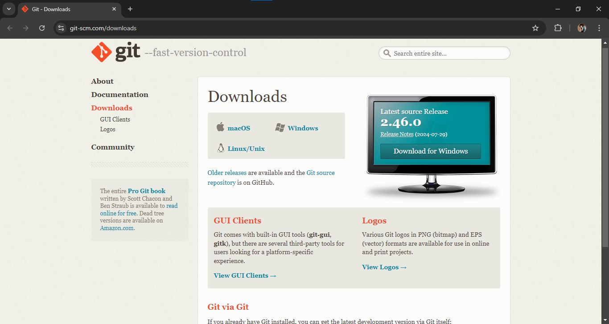
2. Klik pada file installer yang didownload untuk memulai proses instalasi.
3. Pada jendela "Git Setup", ikuti langkah-langkah berikut:  
    a. Baca dan setujui lisensi, lalu klik "Next".  
    b. Pilih lokasi instalasi atau gunakan yang default, lalu klik "Next".  
    c. Pilih komponen yang ingin diinstal. Biasanya setelan default sudah cukup, klik "Next".
4. Tunggu proses instalasi selesai, lalu klik "Finish" untuk keluar dari jendela instalasi.
    Setelah instalasi selesai, Anda dapat membuka Git Bash dari menu Start atau dengan mencari "Git Bash" di laptop/komputer.

# Masuk Ke Github
1. Buka website Github di [https://github.com/](https://github.com/)
3. Klik tombol "Sign up" yang terletak di kanan atas halaman.
    
4. maka akan muncul tampilan di bawah,silahkan ketik email anda lalu pencet **"continue"**
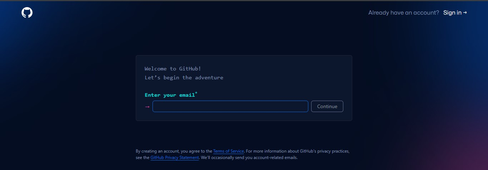
5.  lalu buatlah password yang kuat dan mudah diingat,pencet **"continue"**

6. buat username anda,jika sudah pencet **"continue"**
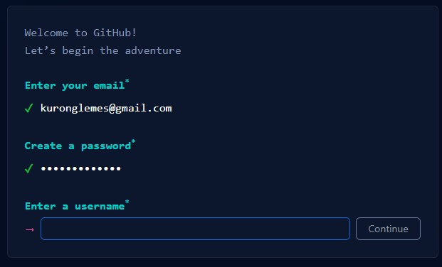
7. Setelah mengisi formulir, klik tombol **"Create account".**
8. Pada halaman selanjutnya, GitHub akan meminta Anda untuk memverifikasi alamat email. Cek inbox email Anda dan klik tautan verifikasi yang dikirimkan oleh GitHub.
9. Setelah email berhasil diverifikasi, Anda akan diarahkan ke dashboard akun GitHub Anda.
  ***Opsional:*** Lengkapi profil Anda dengan informasi tambahan, seperti foto profil, bio, dan lokasi.
  
1. **Buat Repositori GitHub Baru**:
   - Klik tombol "New" untuk membuat repositori baru.

   - Berikan nama repository anda, pilih apakah akan bersifat publik atau privat, lalu klik "Create repository".
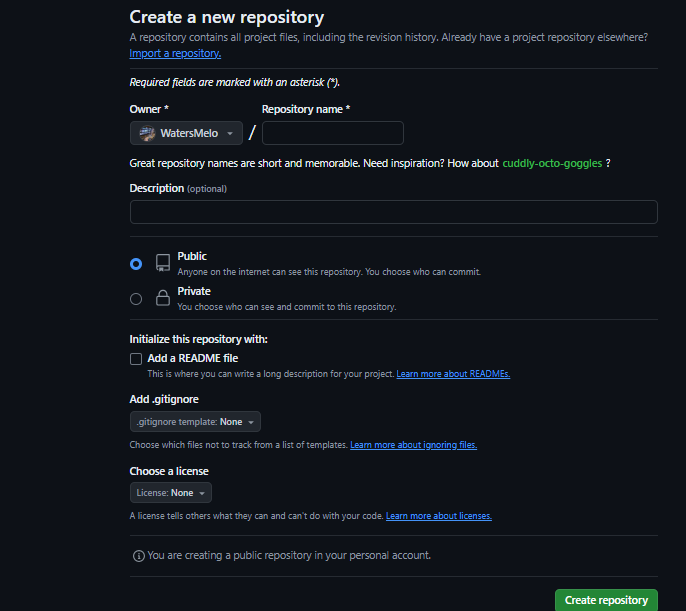
# menghubungkan Folder Proyek lokal ke github
## Langkah-langkah
1. **Konfigurasi Git Lokal**:
   - Buka git di laptop/komputer anda.
   - Jalankan perintah berikut untuk mengatur identitas Anda:
    ```cs
     git config --global user.name "Nama Anda"
     git config --global user.email "email@example.com"
     ```
    **Note:** untuk melihat apakah sudah terhubung konfigurasi git nya silakan ketik 
    `git config --list`
 **contohnya:** 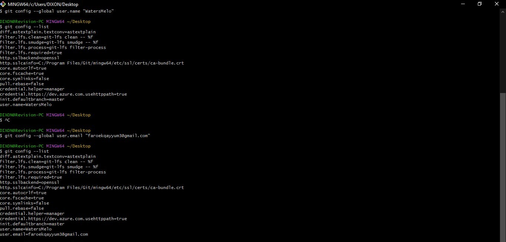
	 
2. **Inisialisasi Git Lokal**:
   -  Buat direktori baru untuk proyek Anda dan navigasikan ke direktori tersebut menggunakan Git bash. Kemudian, inisialisasi Git di direktori tersebut dengan menjalankan perintah:
     ```cs
     git init
     ```
     **contohnya:** 
     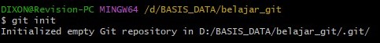
     
3. **Hubungkan ke Repositori GitHub**:
   - Jalankan perintah berikut untuk menghubungkan repositori lokal Anda ke repositori GitHub yang telah Anda buat sebelumnya:
     ```cs
     git remote add origin https://github.com/username/nama-repository.git
     ```
   Ganti `username` dan `nama-repository` dengan nama pengguna GitHub Anda dan nama repositori yang Anda buat.kalo dah ada tulisan (master),berarti sudah terhubung ke repositori Githubnya
   **contohnya:**
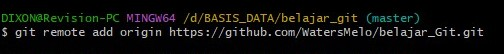
     
4. **Tambahkan file ke repositori**: 
   - Perintah ini akan menambahkan semua file di direktori saat ini ke repositori.
   - Tambahkan file yang ingin Anda simpan di repositori Git dengan menjalankan perintah:
     ```cs
     git add .
     ```
   **contohnya:**
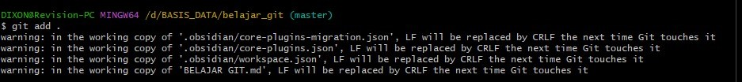

5. **Buat Commit:**
   - Jalankan perintah berikut untuk membuat commit dengan pesan yang jelas:
   - Perintah git commit -m ***"Pesan commit"*** digunakan untuk menyimpan perubahan yang telah dilakukan pada repositori Git dengan menambahkan pesan
     ```cs
     git commit -m "Pesan commit"
     ```
     **contohnya:** 
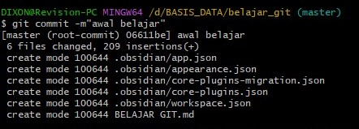
     
   Unggah ke GitHub(git push origin master):
   Terakhir, jalankan perintah berikut untuk mengunggah kode Anda ke GitHub:

6. **Unggah ke GitHub**:
   - Terakhir, jalankan perintah berikut untuk mengunggah kode Anda ke GitHub:
     ```cs
     git push origin master
     ```
     **contohnya:**
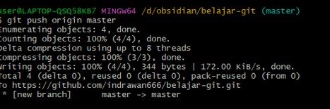
    Jika tetampil bgini,berarti anda disuruh untuk login akun github mu yang sudah kamu buat
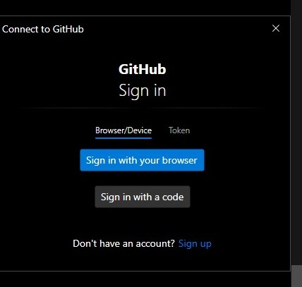

Perintah ini akan mengunggah kode Anda ke repositori GitHub. Setelah ini, setiap kali Anda membuat perubahan pada kode, Anda dapat mengulangi langkah 4, 5, dan 6 untuk mengunggah perubahan tersebut ke GitHub.

- **Git status**
Perintah `git status` dapat dijalankan pada saat kapan pun selama Anda berada di dalam sebuah repository Git.Perintah ini akan menunjukkan status terkini dari repository tersebut, termasuk:
1. **Branch yang aktif**: Menampilkan cabang (branch) mana yang sedang Anda gunakan saat ini.
    
2. **File yang telah dimodifikasi**: Menampilkan daftar file yang telah diubah sejak commit terakhir.
    
3. **File baru yang belum dilacak**: Menampilkan daftar file baru yang belum pernah ditambahkan ke repository.
    
4. **File yang dihapus**: Menampilkan daftar file yang telah dihapus dari repository.
   Perintah ini akan mengunggah kode Anda ke repositori GitHub. Setelah ini, setiap kali Anda membuat perubahan pada kode, Anda dapat mengulangi langkah 4, 5, dan 6 untuk mengunggah perubahan tersebut ke GitHub.
   
***Itulah langkah-langkah untuk menghubungkan proyek ke GitHub***
# Akses Folder Proyek di Git Bash
## cd 
- Fungsi: Digunakan untuk berpindah ke direktori (folder) lain dalam sistem file.
- Contoh penggunaan:
```shell
cd 'nama document'
```
  - `cd Documents` - Berpindah ke direktori "Documents".
  - `cd ..` - Berpindah ke direktori induk (satu level di atas).
  **tampilannya:**

## ls 
- Fungsi: Digunakan untuk melihat daftar file dan direktori yang ada di dalam direktori saat ini.
- Contoh penggunaan:
```shell
ls
```
  - `ls` - Menampilkan daftar fle di dalam direktori saat ini
**tampilannya:**
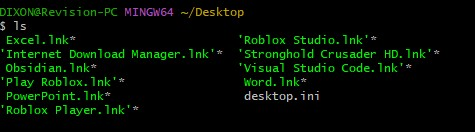
## pwd
- Fungsi: Digunakan untuk melihat path (jalur) direktori kerja saat ini.
- Contoh penggunaan:
```cs
pwd
```
`pwd` - Menampilkan path direktori kerja saat ini.
**tampilannya:**
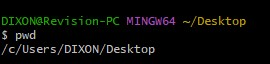
